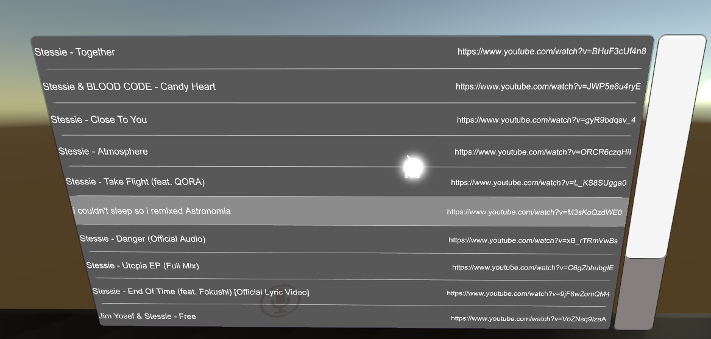

# Playlist Plugin
This plugin is a list of videos (external media URLs) that are pre-defined and setup ahead of time by the world creator.  
The playlist has two parts to it: the inspector and the template  

## SUPPORT ME!
<a href='https://ko-fi.com/I3I84I3Z8' target='_blank'></a>

### The Inspector
In the playlist inspector editor, there are a handful of settings to mess with.  
The first option is the TV object reference that the playlist will associate itself with. You will need to provide the reference connection yourself, 
or if you are using a ready-made prefab, it should already be connected.  

Next up is the two template references, one is the container, the other is the actual template itself. These come with default references out of the box in the prebuilt plugin prefabs. Have a look at the [Templating Section](#Templates) for more information.  

Following that is the flags section. These options are toggles to determine how the playlist handles itself.

- *Autoplay*: Flag for whether or not the playlist should automatically play through the videos in the list. As long as this toggle is enabled (can be disabled in-game via script if desired), the playlist will continually ensure that some video is playing. It will only attempt to queue a video if the TV is not playing anything or any existing media has ended and no other plugins have told the connected TV to play anything else (for example the Queue plugin).
- *Continue from where it left off*: If the playlist detects that the TV is playing a video that is NOT in its own list of videos, this flag specifies whether or not to have the playlist start at the top/begining of the list, or to continue from the last video that the playlist had switched to.
- *Continue after a video error*: Specifies whether or not to automatically play the next video in the list when the TV encounters a video error.
- *Show urls in playlist*: This toggle makes the playlist template skip displaying the URL for each entry. This is useful if you want to hide what domain/source of the video.
- *Load from Text File*: Toggles the inspector mode to file import. This allows pulling in playlist data from a custom text file (see more details below).

Below that is the playlist entries management.


### Usage
Firstly, when you add any Playlist prefab to the scene, make sure to UNPACK COMPLETELY before doing anything. There are issues with the custom inspector on this plugin when not unpacked from the prefab.  
Secondly set the TV reference and autoplay settings as needed.  
Lastly add whatever videos you want to the playlist entries.
That's all you need to do.

Alternatively, instead of entering each URL and title individually, you can create a txt file in the Assets folder somewhere and put the list of videos in there. This should help make playlist management much more efficient.  
In the txt file, in order for it to detect URLs, you need to prefix the urls with the @ symbol, then directly below it put whatever title text you want to. It also supports images as well. Those get prefixed with a / on the line after the URL (see second example entry).  
For example, say we have 3 videos. The txt file might look like this:
```txt
@https://www.youtube.com/watch?v=BHuF3cUf4n8
Stessie - Together
This song is pretty cool.

@https://www.youtube.com/watch?v=JWP5e6u4ryE
/Assets/CustomImages/stessie.candy.heart.png
Stessie & BLOOD CODE - Candy Heart

@https://www.youtube.com/watch?v=gyR9bdqsv_4
Stessie - Close To You
```
You'll notice that the first song has two lines. The format uses the @ to determine the URL, then optionally looks for the image prefix `/`, then any lines that come after it are the title text (including any line breaks). It will continue until it sees another @ in which case it creates a new URL entry.  
To import the playlist txt file, simply tick the `Load From Text File` toggle, drag your txt file asset into the input box and click Import.  
Be aware that importing a text file overwrites the current playlist content. You'll want to make sure you are ok with overwriting the content before importing.

If the playlist breaks or something goes wrong with the scene, you can click the `Update Scene` button to force a hard refresh of the playlist in scene.  
Be aware that the more entries a playlist has, the longer it will take to rebuild.

### NOTE
- When working with the images for a playlist, it is highly advised to attach them to a sprite atlas for more performant rendering. See:  
https://docs.unity3d.com/2018.4/Documentation/Manual/SpriteAtlasWorkflow.html

- If you wish to toggle visibility of the playlist and your playlist contains more than 250 entries, it is recommended to call the `_Enable/_Disable` events on the playlist script itself instead of toggling SetActive on its gameObject. This is because when SetActive is called on a UnityUI Canvas, every piece of information about the canvas is completely recalculated. It makes the SetActive operation a very expensive one. The enable and disable events utilize canvas component toggling which is much more performant.

- It is subsequently recommended to have a Canvas component on the template root object so that the Playlist Search feature can make use of the more performant toggling method as well.


## Pre-made prefabs

### Ancient Playlist Prefab Sample


### Sleek Playlist Prefab Sample


### Image Playlist Prefab Sample

